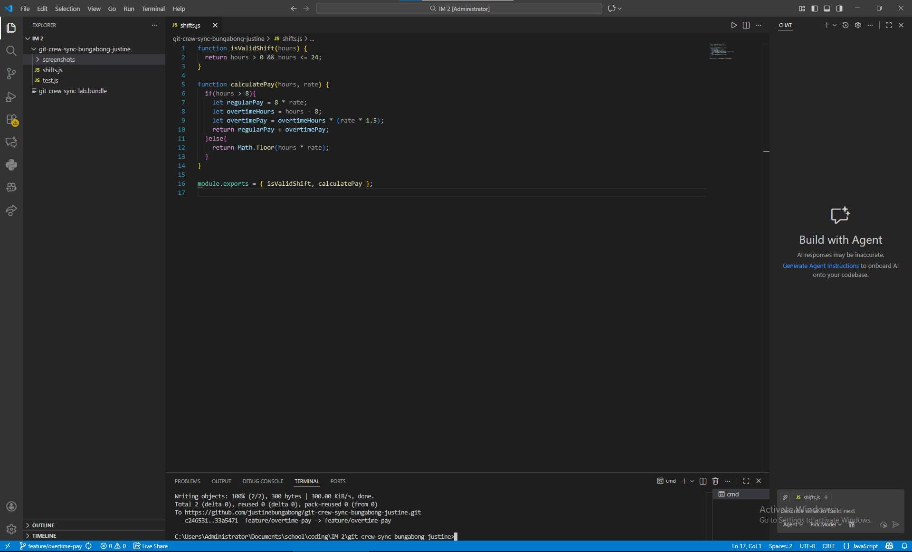
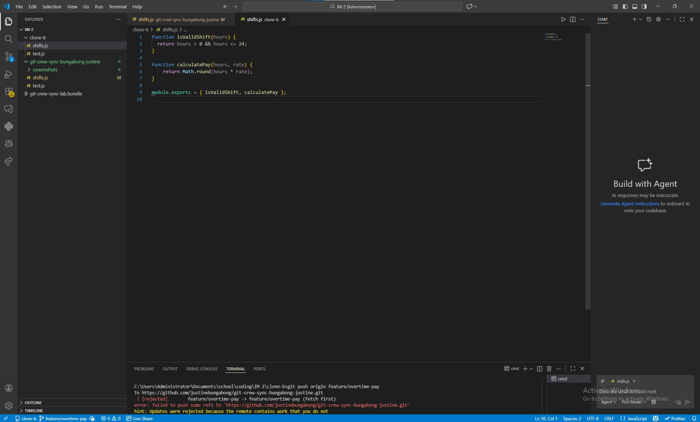
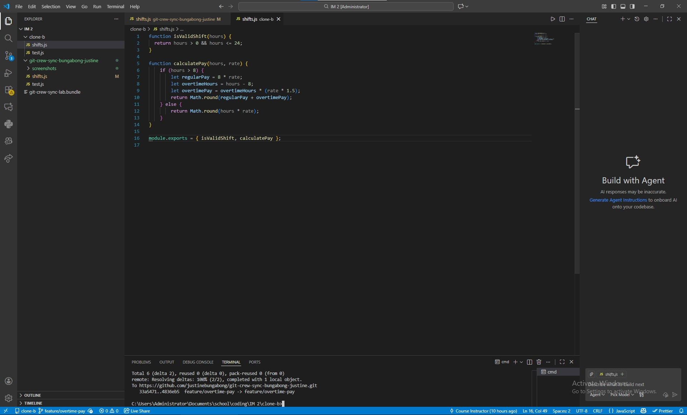
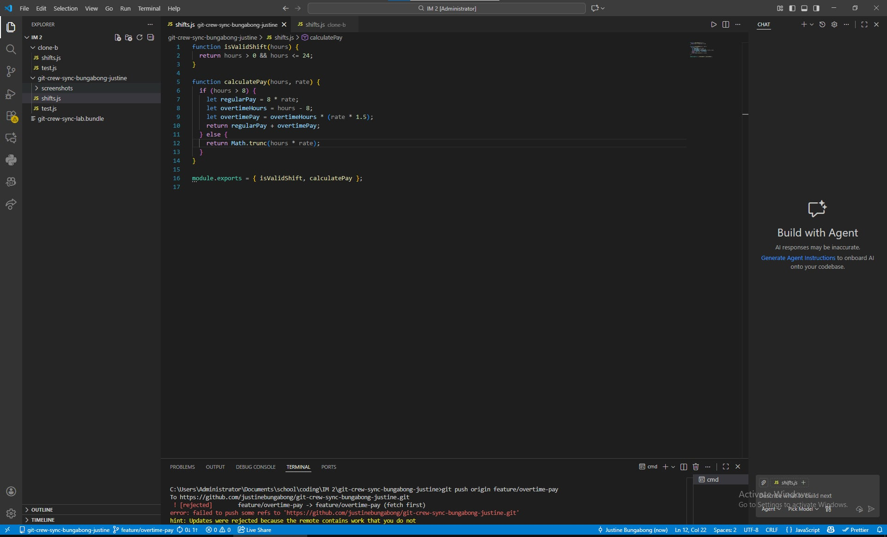
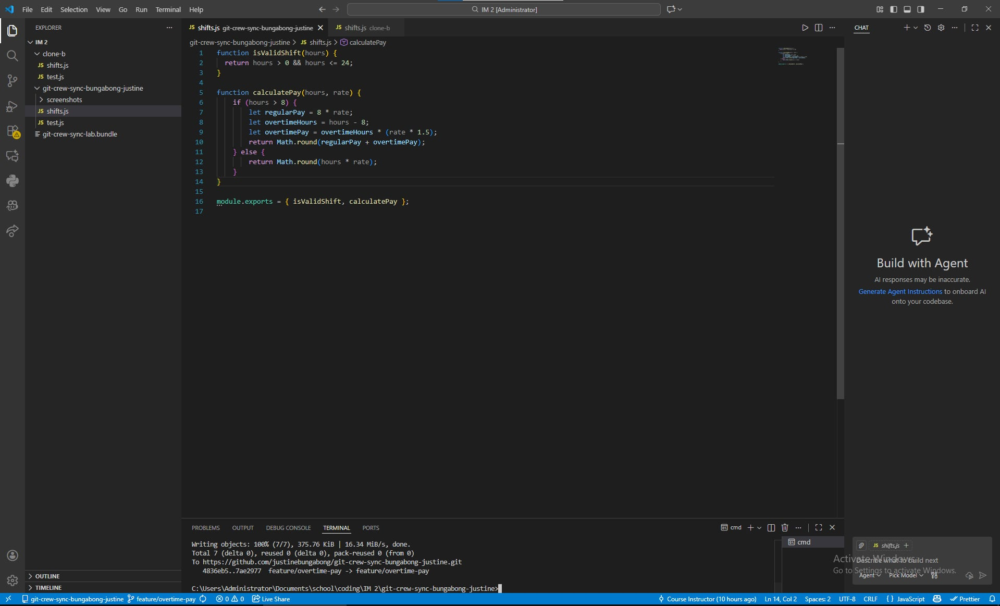
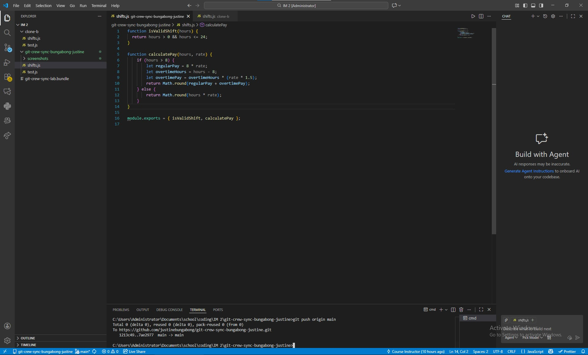
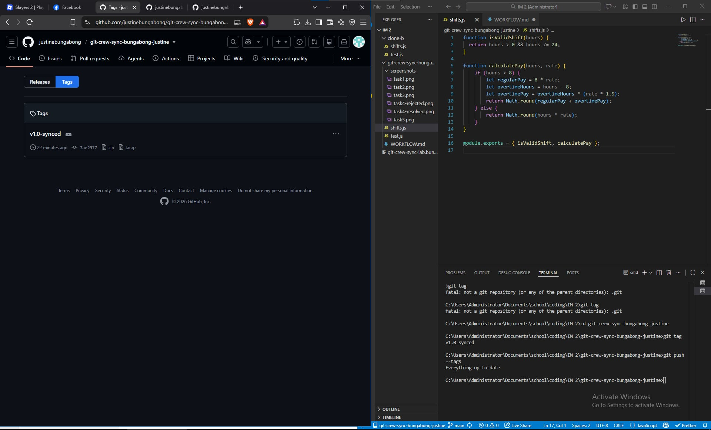

## Questions

**1. What did the rejected push error message tell you, and why did it happen?**
The error told me that my teammate had already pushed a new code into that repo, meaning I was updating an old file which was already changed by my teammate.

**2. What's the actual difference between how you resolved Task 3 (merge) vs Task 4 (rebase)?**
In Task 3 (merge), Git combined the two separate branch histories and created a brand new 'merge commit' to tie them together. In Task 4 (rebase), Git rewrote the history by temporarily setting my commit aside, applying the remote code first, and then 'replaying' my commit on top of it, which kept the history in a straight line without an extra merge commit.

**3. What one habit would have avoided both rejected pushes in this lab?**
Always run the fetch command before doing any changes to make sure you are in the latest changes made.

**4. Which approach - merge or rebase - would you default to on a shared team branch, and why?**
I would default to merging because it preserves the true historical documentation of the project, even though rebasing keeps the commit history looking cleaner.

## Screenshot Evidence

### Task 1

### Task 2

### Task 3

### Task 4

### Task 5

### Task 6
